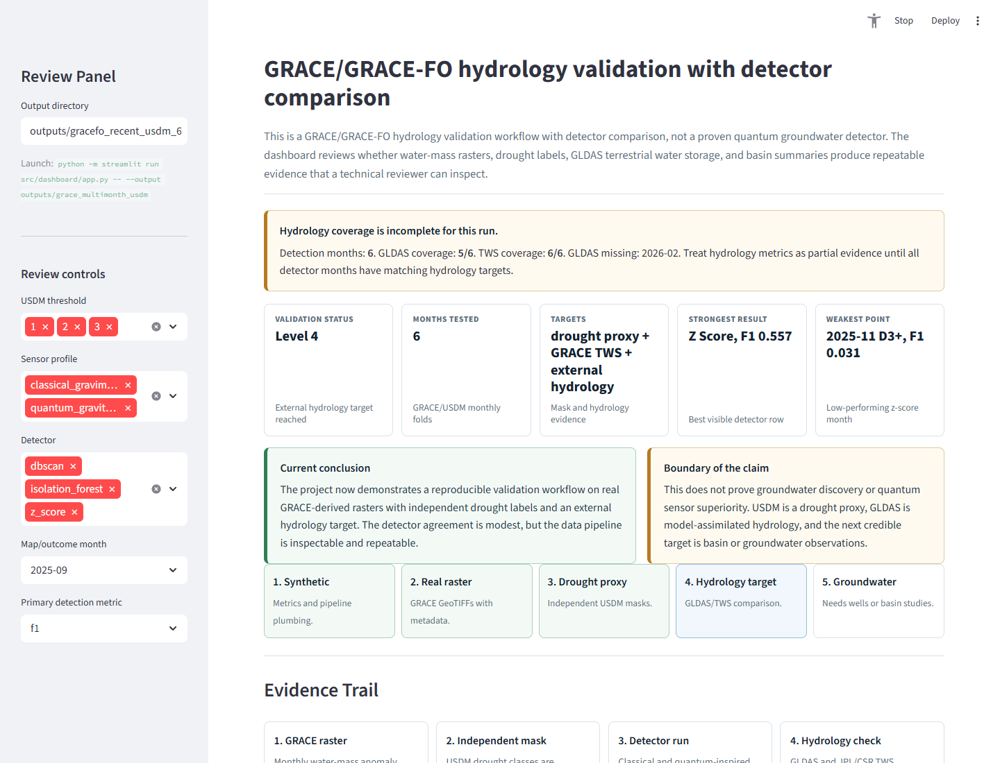

# Quantum Sensing Earth

Reproducible **GRACE/GRACE-FO hydrology validation** with detector comparison and quantum-sensing-inspired sensor simulation.

This project asks a narrow, reviewable question: can gravity-derived water-mass rasters be processed into a transparent validation workflow and compared against independent drought and hydrology targets such as USDM, GLDAS/TWS, and basin summaries?

What it currently proves:

- The pipeline can run reproducibly from validation grids through sensor simulation, detector comparison, calibration, metrics, and reports.
- Real or pseudo-real geospatial rasters can carry CRS, resolution, nodata, provenance, and mask metadata into review artifacts.
- Detector outputs can be compared against independent drought proxies and external hydrology targets without hiding partial coverage or weak labels.

What it does not prove:

- It is not a proven quantum groundwater detector.
- USDM and GLDAS are not direct groundwater truth.
- Detector F1 against drought masks should not be presented as evidence of field-ready groundwater discovery.



## Project Documents

- [What this project does](docs/WHAT_THIS_PROJECT_DOES.md)
- [Finish-line plan](docs/FINISH_LINE_PLAN.md)
- [Sprint plan](docs/SPRINT_PLAN.md)
- [Product backlog](docs/PRODUCT_BACKLOG.md)
- [Project management plan](docs/PROJECT_MANAGEMENT_PLAN.md)
- [Data sources](docs/DATA_SOURCES.md)
- [Scientific claims](docs/SCIENTIFIC_CLAIMS.md)
- [Dashboard guide](docs/DASHBOARD_GUIDE.md)

## One-Command Demo

Generate a download-free, reproducible review artifact from committed example fixtures:

```bash
python -m quantum_sensing_earth.demo --output outputs/demo
```

Then inspect the generated static report at `outputs/demo/report/report.html`. For the interactive Streamlit dashboard, use a multimonth output such as `outputs/gracefo_recent_usdm_6mo`:

```bash
python -m streamlit run src/dashboard/app.py -- --output outputs/gracefo_recent_usdm_6mo
```

## Quick Start

```bash
cp .env.example .env
make setup
make run
make test
```

If `python` is not on your system path, run the same commands with the Codex bundled Python path shown by the workspace dependency tool.

## CLI Usage

Run the default configured benchmark:

```bash
python -m src.main
```

Run 100 synthetic seeds with two detectors and a custom output directory:

```bash
python -m src.main --seeds 100 --detectors z_score dbscan --output outputs/run_002
```

Run a parameter sweep:

```bash
python -m src.main --seeds 42-46 --detectors z_score dbscan isolation_forest --sweep --output outputs/sweep_001
```

By default, sweep runs automatically create a separate `best_config_*` folder inside the output directory. That rerun evaluates only the best parameter setting for each sensor/detector pair so tuning results and final evaluation are not mixed together. Use `--no-best-config-rerun` to skip it.

Seed formats:

- `100` means seeds `0` through `99`
- `42,43,44` means an explicit list
- `42-46` means an inclusive range

## Validation Data

You can run against an external gravity grid and optional anomaly mask:

```bash
python -m src.main --validation-grid examples/validation_grid.csv --validation-mask examples/validation_mask.csv --detectors z_score dbscan --output outputs/validation_demo
```

Attach provenance and preprocessing:

```bash
python -m src.main --validation-grid examples/validation_grid.csv --validation-mask examples/validation_mask.csv --validation-manifest examples/validation_manifest.yaml --preprocess-detrend --preprocess-normalize zscore --calibrate-thresholds --output outputs/validation_calibrated
```

Generate and run a larger pseudo-real fixture:

```bash
python examples/generate_pseudo_real_validation.py
python -m src.main --validation-grid examples/pseudo_real_gravity_grid.csv --validation-mask examples/pseudo_real_validation_mask.csv --validation-manifest examples/pseudo_real_validation_manifest.yaml --validation-anomalies examples/pseudo_real_anomalies.json --detectors z_score dbscan isolation_forest --calibrate-thresholds --calibration-split left-right --output outputs/pseudo_real_validation
```

Generate and run the same fixture as GeoTIFF, including CRS, affine transform, bounds, nodata, and resolution metadata from `rasterio`:

```bash
python -m pip install -e .[geo]
python examples/generate_pseudo_real_validation.py
python -m src.main --validation-grid examples/pseudo_real_gravity_grid.tif --validation-mask examples/pseudo_real_validation_mask.tif --validation-manifest examples/pseudo_real_geotiff_manifest.yaml --validation-anomalies examples/pseudo_real_anomalies.json --detectors z_score dbscan isolation_forest --calibrate-thresholds --spatial-folds 4 --output outputs/geotiff_validation
```

Supported validation formats:

- Rectangular `.csv` grid with one row per grid row
- Long-form `.csv` with `x`, `y`, and `gravity` columns
- `.npy` arrays
- Optional `.tif/.tiff` rasters when `rasterio` is installed with `python -m pip install -e .[geo]`

The optional mask must have the same shape as the gravity grid. Mask values are treated as booleans where nonzero means anomaly.
The optional `--validation-anomalies` JSON file provides object-level anomaly metadata for per-anomaly localization and recall metrics.

For a real public-data starting point, see [examples/grace_tellus/README.md](examples/grace_tellus/README.md). It includes a GRACE Tellus manifest template, GeoTIFF/netCDF conversion skeleton, and weak-label mask generation script.

Validate a GRACE/real-data manifest before running:

```bash
python -m src.main doctor --manifest examples/grace_tellus/validation_manifest.template.yaml
```

Create a download-free GRACE-like demo run:

```bash
python -m src.main make-grace-demo --output outputs/grace_demo --spatial-folds 4
```

The demo command generates a mock GeoTIFF grid, weak-label mask, manifest, and full HTML report. It is intended for CI and onboarding, not scientific validation.

For a base-dependency demo that does not require GeoTIFF support, use:

```bash
python -m quantum_sensing_earth.demo --output outputs/demo
```

Run a recent GRACE-FO + USDM validation batch:

```bash
python examples/grace_tellus/run_multimonth_usdm.py --mission grace-fo --start 2026-01-01 --months 3 --thresholds 1 2 3 --spatial-folds 4 --output outputs/gracefo_recent_usdm
python -m streamlit run src/dashboard/app.py -- --output outputs/gracefo_recent_usdm
```

Older GRACE runs, such as the April 2002 demo, are useful for pipeline testing but should not be treated as present-day drought or groundwater evidence. The dashboard flags stale runs and recommends regenerating with current GRACE-FO collections.

Run the Central Valley groundwater-validation scaffold after preparing DWR Bulletin 118 basin boundaries and a DWR groundwater observation CSV:

```bash
python examples/central_valley/prepare_central_valley_basins.py
python examples/grace_tellus/run_multimonth_usdm.py --mission grace-fo --study-region central-valley --start 2025-01-01 --months 6 --thresholds 1 2 3 --spatial-folds 4 --groundwater-observations path\to\dwr_periodic_groundwater_levels.csv --groundwater-source dwr-periodic --output outputs\central_valley_groundwater_001
python -m streamlit run src/dashboard/app.py -- --output outputs/central_valley_groundwater_001
```

This starts groundwater validation with basin wells. It still does not prove groundwater discovery or quantum advantage.

The multimonth runner also writes basin-scale validation artifacts using `examples/grace_tellus/western_us_basins.geojson` by default:

- `basin_metrics.csv`: per-basin, per-month GRACE mean, GLDAS mean, and USDM drought coverage
- `basin_summary.csv`: per-basin correlation, one-month lag correlation, trend agreement, and drought relationship metrics
- `basin_summary.json`: basin fixture provenance and limitations

The included basin polygons are approximate workflow fixtures. Replace them with authoritative basin, aquifer, HUC, or groundwater-management boundaries before making scientific claims.

See `docs/REAL_DATA_IMPORT.md` for guidance on converting real gravity rasters such as GeoTIFFs into MVP-compatible arrays.

Validation manifests record dataset source, date range, units, preprocessing notes, mask provenance, citation, and limitations. The report displays these fields in its provenance panel.

The larger pseudo-real fixture is still synthetic, but it includes a documented CRS, resolution, units, generation method, mask provenance, and limitations in `examples/pseudo_real_validation_manifest.yaml`. It is intended for scientific workflow inspection, not as field evidence.

Preprocessing options:

- `--missing none|zero|median|mean`
- `--preprocess-detrend`
- `--preprocess-normalize none|zscore|standardize|minmax`
- `--preprocess-clip low,high`
- `--calibrate-thresholds`
- `--target-fpr 0.01`
- `--calibration-split none|left-right|top-bottom`
- `--spatial-folds 4`

When `--calibrate-thresholds` is enabled, z-score, DBSCAN, and isolation forest can all tune detector parameters. With `--calibration-split left-right` or `--calibration-split top-bottom`, tuning uses one region and reported metrics use the held-out region to avoid tuning directly on the final evaluation area. With `--spatial-folds K`, the run performs K spatial train/evaluate folds and exports separate tuning metrics alongside held-out evaluation metrics.

## Outputs

Each run writes:

- `report.html`: browser-friendly report with top-line cards, sortable tables, embedded overlays, and artifact links
- `results.json`: complete nested result payload
- `results.csv`: per-seed, per-sensor, per-detector metrics
- `summary.csv`: mean, std, min, max, and 95% confidence intervals
- `best_params.csv`: best parameter setting per sensor and detector, ranked by mean F1
- `metadata.json`: CLI args, config snapshot, runtime info, timestamp, and package versions
- `artifact_manifest.json`: every review artifact, producer command, timestamp, type, and dashboard-required flag
- `experiment_summary.md`: short narrative summary
- `*_overlay.png`: anomaly mask overlays for the first rendered seed
- `detection_quality_comparison.png`: aggregate detector quality chart
- `metric_uncertainty.png`: F1, IoU, RMSE, and SNR confidence interval plot
- `best_config_*/`: automatic best-config rerun output when `--sweep` is used

Reports also include science-readiness badges, a real-data ingestion checklist, and k-fold aggregate/per-fold calibration tables when spatial folds are enabled.

## Interactive Dashboard

The static HTML reports remain as portable artifacts, but the preferred way to inspect larger validation runs is the Streamlit dashboard:

```bash
python -m pip install -e .[dashboard,geo]
python -m streamlit run src/dashboard/app.py -- --output outputs/grace_multimonth_usdm
```

The dashboard reads existing run artifacts such as `timeline_metrics.csv`, GLDAS/TWS summary JSON, GeoTIFF grid/mask paths, and generated PNG overlays. It provides a technical-review validation story with a first-screen credibility summary, an evidence trail, coordinate-aware study-region map, detector timelines, hydrology comparison charts, outcome thumbnails, and provenance links.

For multimonth runs, the dashboard also reads `coverage_summary.json`, `month_alignment.csv`, `basin_metrics.csv`, and optional groundwater files: `groundwater_observations.csv`, `groundwater_basin_monthly.csv`, `groundwater_validation_metrics.csv`, `groundwater_validation_summary.json`, and `groundwater_summary.json`.

## Parameter Sweeps

`--sweep` currently evaluates:

- `z_score.threshold`: `2.0`, `2.5`, `3.0`
- `dbscan.eps`: `0.25`, `0.4`, `0.6`
- `isolation_forest.contamination`: `0.03`, `0.05`, `0.08`

Sweep winners are exported to `best_params.csv` and highlighted in `report.html`.

Calibration uses a wider internal candidate set for the active detector family and records the selected parameters in `results.json`, `results.csv`, and `metadata.json`.

## Packaging

Install as an editable local tool:

```bash
python -m pip install -e .[dev]
quantum-sensing-earth --seeds 5 --detectors z_score dbscan --output outputs/package_smoke
```

## Core Workflow

```text
Synthetic or validation gravity field
-> Sensor profiles
-> Noisy measurement grids
-> Detector variants
-> Evaluation metrics
-> JSON/CSV/HTML report artifacts
```

## Scientific Limits

Synthetic runs are useful for benchmark plumbing and relative sensitivity tests, but they do not validate a physical quantum sensor model or real groundwater anomalies. Real validation requires calibrated gravity grids and independently supported ground-truth masks.
