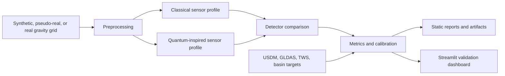

# What This Project Does

## Short Answer

Quantum Sensing Earth is a reproducible hydrology-validation research tool. It takes gravity-derived water-mass grids, simulates classical and quantum-sensing-inspired measurement profiles, runs several anomaly detectors, and compares the resulting detection masks against drought and hydrology validation targets.

The project is currently best described as:

> A reproducible GRACE/GRACE-FO hydrology validation dashboard with detector comparison and quantum-sensing-inspired sensor simulation as one analysis layer.

It is not yet:

> A proven quantum groundwater detector.

That distinction matters. The software can already demonstrate a reviewable workflow from data ingestion to metrics and reports. It cannot yet claim that a real quantum sensor has found groundwater, because the strongest validation target still needs to be direct basin storage, groundwater wells, or another independent groundwater-related observation record.

## The Core Question

The project asks:

Can gravity-derived water-mass signals be processed into a transparent, repeatable validation workflow and compared against independent drought or hydrology targets in a way that a technical reviewer can inspect?

The current answer is:

Yes, for workflow validation and early hydrology comparison. Not yet for groundwater discovery claims.

## Why Gravity and Hydrology

Large changes in groundwater, soil moisture, snow water equivalent, surface water, and other mass-storage terms slightly change Earth's gravity field. Satellite gravity missions such as GRACE and GRACE-FO are designed to observe those broad water-mass changes over time. The spatial resolution is coarse, but the signal is physically related to terrestrial water storage.

This project uses that idea as a validation setting:

- GRACE/GRACE-FO grids provide real gravity-derived water-mass anomaly data.
- USDM drought masks provide an independent drought-proxy label.
- GLDAS/TWS products provide hydrology targets closer to water storage than drought severity.
- Basin summaries provide a more scientifically honest aggregation level than pixel-level claims on coarse grids.

The quantum-sensing component enters as a sensor-profile comparison. The software asks whether a cleaner or more sensitive gravity measurement profile could improve downstream detection, while keeping the scientific messaging bounded by what the data can support.

## What The Project Currently Proves

The project currently proves that the software workflow can:

- Generate synthetic and pseudo-real gravity anomaly fields.
- Load validation grids from CSV, NumPy arrays, and optional GeoTIFF rasters.
- Preserve geospatial metadata such as CRS, bounds, transform, resolution, and nodata when rasterio is installed.
- Apply preprocessing such as missing-data handling, detrending, normalization, and clipping.
- Simulate classical and quantum-inspired sensor measurement profiles.
- Run multiple detector families side by side.
- Tune detector parameters through calibration or sweeps.
- Evaluate predictions against known masks and anomaly metadata.
- Run spatial train/tune/evaluate splits and k-fold spatial validation.
- Export machine-readable metrics, metadata, plots, and reports.
- Display a Streamlit dashboard that explains what was validated, what evidence exists, and where the scientific limits are.
- Create a download-free demo that can run in CI and help new users inspect the workflow.

## What The Project Does Not Prove

The project does not currently prove:

- That a physical quantum sensor has been built or deployed.
- That detector outputs are field-validated groundwater discoveries.
- That USDM drought masks are direct groundwater truth.
- That GLDAS is independent ground truth for groundwater.
- That detector F1 against drought masks is enough to make groundwater claims.
- That coarse GRACE/GRACE-FO grids can localize small aquifers or site-scale groundwater anomalies.

The project should be presented as validation software and early hydrology comparison until basin observations, groundwater wells, or another direct groundwater/storage target are added.

## Main Audience

The project is intended for:

- Technical reviewers evaluating reproducibility and validation design.
- Climate and hydrology analysts exploring gravity-derived water-mass workflows.
- Quantum sensing researchers evaluating downstream Earth-observation use cases.
- Software collaborators who need a clear artifact contract for experiments, dashboards, and data ingestion.
- Early stakeholders who need to understand the difference between a credible workflow and a scientific proof.

## System Overview

At a high level, the project has five layers:

1. Data input and preprocessing
2. Sensor simulation
3. Detector comparison and calibration
4. Evaluation and reporting
5. Dashboard storytelling and scientific readiness



## Data Sources and Target Types

The project supports several levels of data credibility.

| Level | Data Type | Purpose | Scientific Strength |
| --- | --- | --- | --- |
| Synthetic | Generated anomaly fields | Test detector plumbing and metric behavior | Low; software-only |
| Pseudo-real | Larger generated fixtures with geospatial metadata | Exercise geospatial workflow without private downloads | Moderate for workflow inspection |
| Real raster | GRACE/GRACE-FO derived grids | Use real gravity-derived water-mass products | Stronger, but still needs target quality |
| Drought proxy | USDM drought masks | Independent drought-label comparison | Useful proxy, not groundwater truth |
| Hydrology target | GLDAS/TWS | Compare against terrestrial water storage or related hydrology fields | Stronger physical relevance than drought masks |
| Basin observation | Groundwater wells, basin storage, aquifer studies | Directer validation target | Required for groundwater claims |

## Current Data Workflows

### 1. Download-Free Demo

The fastest way to see the project work is:

```bash
python -m quantum_sensing_earth.demo --output outputs/demo
```

This command copies committed pseudo-real example fixtures into an output directory, runs a validation experiment, and produces a static report. It does not require private downloads or Earthdata credentials.

This is for:

- CI confidence
- onboarding
- demonstrating the artifact contract
- showing the end-to-end validation flow

It is not for:

- scientific interpretation
- current drought conditions
- groundwater-discovery claims

### 2. Synthetic Benchmark Runs

The default CLI can generate synthetic gravity anomaly fields and run detector comparisons:

```bash
python -m src.main --seeds 100 --detectors z_score dbscan isolation_forest --output outputs/run_002
```

This is useful for testing repeatability across random seeds. The synthetic field includes anomaly objects with metadata such as center, sigma, depth, size, and intensity.

### 3. Pseudo-Real Validation Fixtures

The repo includes examples that mimic larger real validation inputs:

- `examples/pseudo_real_gravity_grid.csv`
- `examples/pseudo_real_validation_mask.csv`
- `examples/pseudo_real_validation_manifest.yaml`
- `examples/pseudo_real_anomalies.json`

These fixtures let developers inspect geospatial-style validation behavior without downloading real satellite files.

### 4. Real GRACE/GRACE-FO + USDM Workflow

The multimonth runner can build GRACE/GRACE-FO validation runs with matching USDM drought masks:

```bash
python examples/grace_tellus/run_multimonth_usdm.py --mission grace-fo --start 2026-01-01 --months 3 --thresholds 1 2 3 --spatial-folds 4 --output outputs/gracefo_recent_usdm
```

This workflow can produce:

- monthly GRACE/GRACE-FO rasters
- USDM drought masks at D1+, D2+, and D3+
- detector metrics by month, threshold, sensor, and algorithm
- hydrology comparison artifacts when GLDAS/TWS files are available
- basin-scale summaries using the current basin fixture
- an interactive dashboard-ready artifact set

### 5. GLDAS/TWS Hydrology Track

The GLDAS/TWS track compares GRACE/GRACE-FO water-mass behavior against hydrology targets such as terrestrial water storage anomalies. This is more physically relevant than a drought classification mask, but it is still not direct groundwater truth.

The dashboard reports:

- hydrology month coverage
- missing hydrology months
- correlation
- RMSE
- bias
- trend agreement
- anomaly sign agreement

The project explicitly warns when hydrology coverage is incomplete.

### 6. Basin Validation

The project has begun moving away from a simple rectangular western U.S. crop and toward named basin summaries. Basin-level aggregation is more honest for GRACE/GRACE-FO because the data are coarse and best interpreted over larger regions.

Current basin artifacts can include:

- `basin_metrics.csv`
- `basin_summary.csv`
- `basin_summary.json`

The current included basin geometry is a workflow fixture. It is useful for demonstrating the method, but authoritative basin, aquifer, HUC, or groundwater-management boundaries are needed for stronger scientific interpretation.

## Sensor Simulation Layer

The sensor layer compares two measurement profiles:

### Classical Gravimeter Profile

This profile represents a noisier conventional gravity-measurement baseline. It is used to test how a normal measurement profile performs under the same downstream detector pipeline.

### Quantum Gravity Gradiometer Profile

This profile represents a simulated quantum-enhanced measurement profile with improved measurement characteristics. It is not a hardware model or a deployed sensor. It is a software profile used to ask whether a better measurement surface could improve detection and metrics.

The comparison is intentionally downstream-focused:

- same input field
- different measurement noise/resolution behavior
- same detectors
- same metrics
- side-by-side outputs

## Detector Layer

The project currently supports three detector families.

### z_score

The z-score detector flags unusually strong deviations from the field distribution. It is simple, interpretable, and has generally been the most usable baseline in the current workflow.

Tunable parameter:

- `threshold`

### dbscan

DBSCAN clusters spatial or feature-based points. It can struggle on coarse GRACE grids and broad drought masks because the geometry does not always form the type of dense local clusters DBSCAN expects.

Tunable parameters:

- `eps`
- `min_samples`

### isolation_forest

Isolation forest detects outliers based on how easy points are to isolate. It can be useful, but it may over-detect depending on contamination settings and grid structure.

Tunable parameter:

- `contamination`

## Calibration and Parameter Sweeps

The project can tune detectors instead of relying only on fixed defaults.

Supported calibration features include:

- parameter sweeps
- best-parameter export
- best-config reruns
- calibration against a validation mask
- target false-positive rate calibration
- spatial train/evaluate splits
- k-fold spatial calibration

This helps separate:

- tuning metrics
- held-out evaluation metrics
- final best-configuration performance

That separation matters because tuning and evaluating on the same spatial area can overstate performance.

## Evaluation Metrics

The project exports both detection metrics and hydrology-comparison metrics.

### Detection Metrics

Detection metrics compare predicted anomaly masks against validation masks.

Common metrics:

- precision
- recall
- F1
- IoU
- false positive rate
- false negative rate
- RMSE
- SNR
- localization error
- per-anomaly localization error
- object-level anomaly recall

### Hydrology Metrics

Hydrology metrics compare GRACE/GRACE-FO signals against external hydrology or TWS targets.

Common metrics:

- correlation
- RMSE
- bias
- trend agreement
- anomaly sign agreement
- month coverage
- missing-month count

### Basin Metrics

Basin metrics aggregate values over named regions.

Common metrics:

- GRACE mean anomaly by basin/month
- GLDAS mean anomaly by basin/month
- USDM drought coverage percent
- correlation over time
- lagged correlation
- trend agreement
- strongest and weakest basin callouts

## Output Artifacts

A standard CLI run writes a reviewable artifact bundle.

Typical outputs:

- `report.html`: static browser report
- `results.json`: complete nested result payload
- `results.csv`: per-seed, per-sensor, per-detector results
- `summary.csv`: aggregate metric statistics
- `best_params.csv`: best detector settings
- `metadata.json`: CLI args, config snapshot, timestamp, runtime/package info
- `experiment_summary.md`: short narrative summary
- `*_overlay.png`: anomaly overlays
- `detection_quality_comparison.png`: detector comparison plot
- `metric_uncertainty.png`: confidence interval plot
- `best_config_*/`: best-config rerun outputs when sweeps are enabled

Multimonth GRACE/GRACE-FO runs can additionally write:

- `timeline_metrics.csv`
- `timeline_report.html`
- `gldas_hydrology_metrics.csv`
- `gldas_hydrology_summary.json`
- `tws_comparison_metrics.csv`
- `tws_comparison_summary.json`
- `basin_metrics.csv`
- `basin_summary.csv`
- `basin_summary.json`
- month-level rasters, masks, overlays, and thumbnails

## Streamlit Dashboard

The Streamlit dashboard is the primary technical-review interface for multimonth validation runs.

Launch example:

```bash
python -m streamlit run src/dashboard/app.py -- --output outputs/gracefo_recent_usdm_6mo
```

The dashboard is designed to answer:

- What was validated?
- How many months were tested?
- Which targets were available?
- Were hydrology targets missing for any months?
- Which detector performed best?
- Which months failed?
- What does the basin-scale comparison show?
- What can a reviewer conclude?
- What should a reviewer not conclude?

The first-screen message is intentionally cautious:

> This is a GRACE/GRACE-FO hydrology validation workflow with detector comparison, not a proven quantum groundwater detector.

Dashboard sections include:

- Validation Status
- Evidence Trail
- Study Region
- Basin Validation
- Hydrology Target
- Detection Results
- Limits and Next Step

## Static HTML Reports

The static HTML reports remain useful because they are portable artifacts. They can be opened without running Streamlit and can be archived with experiment outputs.

Static reports are best for:

- CI outputs
- sharing one run
- artifact archives
- quick inspection

Streamlit is better for:

- multimonth exploration
- filters
- technical review
- timeline and basin interpretation

## Manifest and Provenance System

Validation manifests document where data came from and how it should be interpreted.

A good manifest records:

- dataset name
- source URL or source description
- date range
- units
- CRS and resolution when known
- preprocessing notes
- mask method
- mask provenance
- whether the mask is independent
- citation
- limitations

The `doctor` command checks manifests before a run:

```bash
python -m src.main doctor --manifest examples/grace_tellus/validation_manifest.template.yaml
```

The doctor command is meant to prevent accidental over-claiming by warning when citation, mask independence, nodata handling, or other provenance details are missing.

## Repository Structure

Important paths:

| Path | Purpose |
| --- | --- |
| `src/main.py` | Main CLI, experiment orchestration, reporting, manifest doctor, demo helpers |
| `src/dashboard/app.py` | Streamlit technical-review dashboard |
| `src/data/` | Synthetic data generation, geospatial loading, preprocessing |
| `src/models/` | Detector and evaluation logic |
| `src/sensors/` | Classical and quantum-inspired sensor profiles and noise models |
| `src/visualization/` | Plotting and map helpers |
| `quantum_sensing_earth/demo.py` | Download-free one-command demo |
| `examples/` | CSV fixtures, pseudo-real fixtures, GRACE Tellus workflow scripts |
| `examples/grace_tellus/` | GRACE/GRACE-FO, USDM, GLDAS/TWS, and basin workflow scripts |
| `docs/` | Scientific assumptions, validation plans, import docs, limitations, this overview |
| `tests/` | CLI, metric, loader, dashboard-import, and demo smoke tests |
| `.github/workflows/ci.yml` | GitHub Actions CI |

## Main Commands

Install for development:

```bash
python -m pip install -e .[dev,dashboard]
```

Install with geospatial support:

```bash
python -m pip install -e .[dev,dashboard,geo]
```

Run tests:

```bash
python -m pytest -q
```

Run the installed CLI:

```bash
quantum-sensing-earth --seeds 5 --detectors z_score dbscan --output outputs/package_smoke
```

Run the module CLI:

```bash
python -m src.main --seeds 5 --detectors z_score dbscan --output outputs/run_005
```

Run the download-free demo:

```bash
python -m quantum_sensing_earth.demo --output outputs/demo
```

Run the Streamlit dashboard:

```bash
python -m streamlit run src/dashboard/app.py -- --output outputs/gracefo_recent_usdm_6mo
```

## Quality and CI

The repository includes GitHub Actions CI. Current CI checks include:

- package install
- pytest suite
- installed CLI smoke run
- dashboard import smoke test
- download-free demo smoke run

Local test coverage currently exercises:

- synthetic data generation
- sensor noise behavior
- detector metrics
- calibration helpers
- geospatial validation loader behavior
- manifest doctor behavior
- report export behavior
- dashboard import
- demo artifact generation

## Scientific Readiness Ladder

The dashboard and docs use a readiness ladder to avoid over-claiming.

| Stage | Meaning | Current Status |
| --- | --- | --- |
| 1. Synthetic | The software pipeline works on generated fields | Reached |
| 2. Real raster | The workflow can ingest GRACE/GRACE-FO style rasters with metadata | Reached |
| 3. Drought proxy | The workflow compares against independent USDM drought labels | Reached |
| 4. External hydrology target | GLDAS/TWS comparison is available when matching files exist | Partially reached, coverage dependent |
| 5. Groundwater validation | Independent groundwater wells, basin storage, or aquifer observations | Not reached |

The project becomes much more scientifically persuasive after stage 5.

## Key Design Principles

### 1. Reproducibility First

Every run should export enough metadata to understand:

- command-line arguments
- config snapshot
- runtime timestamp
- package versions
- data source
- preprocessing choices
- calibration choices

### 2. Scientific Claim Boundaries

The project should make strong claims about software workflow only when the evidence supports it. It should not present proxy validation as direct groundwater proof.

### 3. Artifact-Backed Review

Every major statement in the dashboard should trace back to CSV, JSON, raster, or image artifacts in the output directory.

### 4. Explicit Missingness

If GLDAS, TWS, masks, months, or provenance fields are missing, the dashboard should show that clearly. Partial evidence should not be made to look complete.

### 5. Basin-Scale Honesty

GRACE/GRACE-FO data are coarse. Basin-level aggregation is usually more defensible than pixel-level interpretation for groundwater or water-storage claims.

## Current Roadmap

The active GitHub issue roadmap tracks:

1. Basin-scale validation with authoritative boundaries
2. GLDAS/TWS month coverage and alignment hardening
3. Groundwater or well-observation validation workflow
4. Dashboard redesign for reviewer-grade visual storytelling
5. Real-data ingestion hardening and reproducibility checks

## Recommended Next Scientific Step

The most important next scientific step is to add a direct or near-direct groundwater/storage target.

Good candidates include:

- USGS groundwater wells
- basin storage observations
- groundwater depletion studies
- Central Valley groundwater datasets
- High Plains Aquifer observations
- authoritative hydrologic basin products
- managed aquifer or water district records

The goal is to compare GRACE/GRACE-FO and detector outputs against a target closer to groundwater truth than USDM drought classes or GLDAS model-assimilated hydrology.

## Recommended Next Product Step

The most important next product step is to improve the Streamlit dashboard storytelling.

The dashboard should make these points unmistakable:

- what data were used
- what months and basins were covered
- which months or targets were missing
- what the detectors got right
- what the detectors got wrong
- how hydrology targets agree or disagree
- what the workflow proves
- what it does not prove
- what dataset is needed next

## Bottom Line

Quantum Sensing Earth is a serious start toward a reproducible gravity/hydrology validation platform. Its strongest current accomplishment is not proving a quantum groundwater detector. Its strongest current accomplishment is building a transparent workflow that can ingest gravity-derived water-mass data, compare multiple detector and sensor assumptions, preserve provenance, evaluate against independent targets, and tell reviewers exactly how strong or weak the evidence is.

The project becomes scientifically much stronger when the next validation target moves from drought and model-assimilated hydrology toward direct basin storage or groundwater observations.
